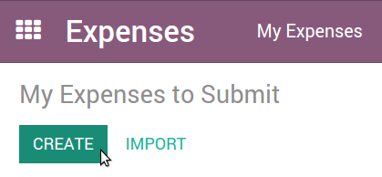
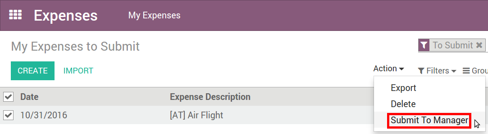
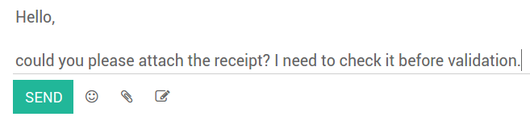

Record Expenses made by Company Employee
========================================

Manually
########
As an employee (Employee in user access rights), you can record expenses from

**My Expenses ‣ Expenses to Submit**.

#. Select the related product and enter either the total amount you paid (with Quantity = 1) or the unit price if Quantity is countable (e.g. number of hotel nights).
#. Enter the expense date.
#. Choose if you paid the bill on your own (and expect to be reimbursed) or if the company paid directly (e.g. if you used a company’s credit card).
#. Set the bill reference, add some notes if requested and attach a photo/scan of the receipt from the discussion thread. That will help the manager and the accountant validate it.

.. image:: expense_submit_02.png
   :align: center

In one click from emails
########################
Let your employees record their expenses from a simple email. Make a snapshot of the receipt and send it by email, or simply forward a bill!

The only thing to do is setting up an email alias in **Expenses ‣ Configuration ‣ Settings** (e.g. expenses @mycompany.odoo.com). For security purposes, only authenticated employee emails (cfr. Work Email in employee detail form) are accepted.

.. tip:: The expense product is set automatically if the mail subject contains the product’s internal reference between brackets (e.g. [Food]). Type the expense amount in the mail subject to set it on the expense too.

How to submit expenses to managers
###################################
When you are ready to submit your expenses to your manager (e.g. at the end of a business trip, or once a month), go to the menu **My Expenses ‣ Expenses to Submit**. Select all expenses from the list view and click on **Action > Submit to Manager**. Save the newly created expense report (i.e. set of expenses), and wait for your manager to approve it.

You can also submit expenses one by one from the Submit to Manager button on the form view of an expense.

All your submitted expense reports can be found in **Expenses ‣ My Expenses ‣ Expense Reports**.

How to approve expenses
#######################

HR and team managers get an overview of all expense reports to validate from the top menu **To Approve ‣ Expense Reports to Approve**. Such users must have at least Officers access rights for Expenses.

.. image:: expense_approval_01.png
   :align: center

They can review expense reports, approve or reject them, as well as providing feedback thanks to the integrated communication tool.

As a team manager you can easily find the expense reports of your team members. You need to be set as manager in the detail form of those employees.

.. image:: expense_approval_03.png
   :align: center

How to post expenses in accounting
##################################

Once expense reports approved by managers, the accounting department goes to **Expenses ‣ Accountant ‣ Expense Reports To Post** to check accounts, products and taxes. They can click **Post Journal Entries** to post related journal entries into your books. To do so, the user must have following access rights:

#. **Accounting: Accountant or Adviser**
#. **Expenses: Manager**

.. tip:: To post an expense, a Home Address must be set on the employee. If you get a related blocking message when posting, click the employee, go to Personal Information tab and select/create the contact of your employee in the address book. A contact has been automatically created if this person is using Odoo.

